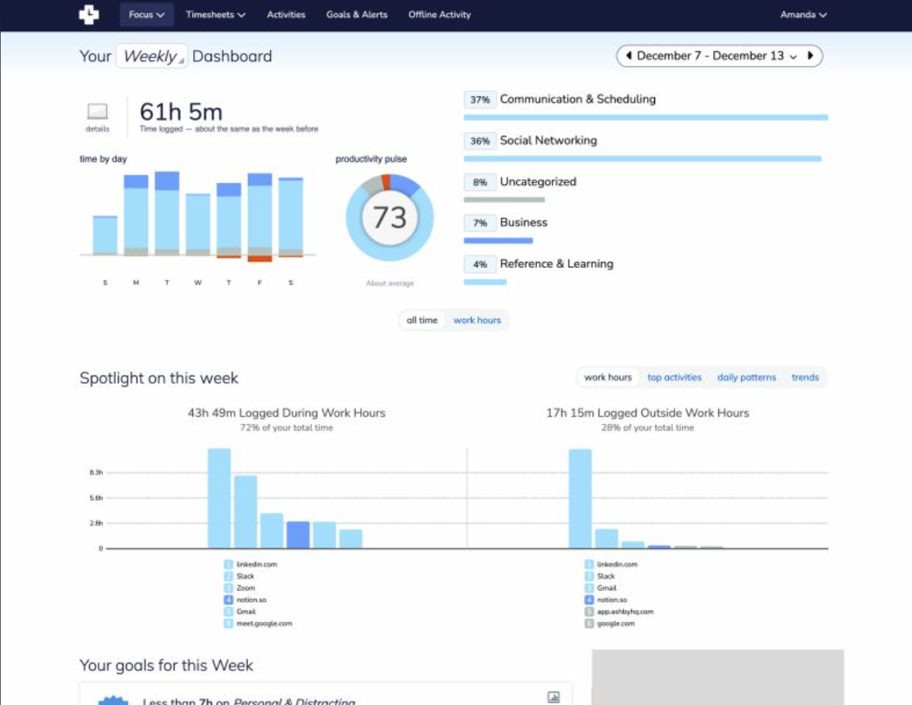
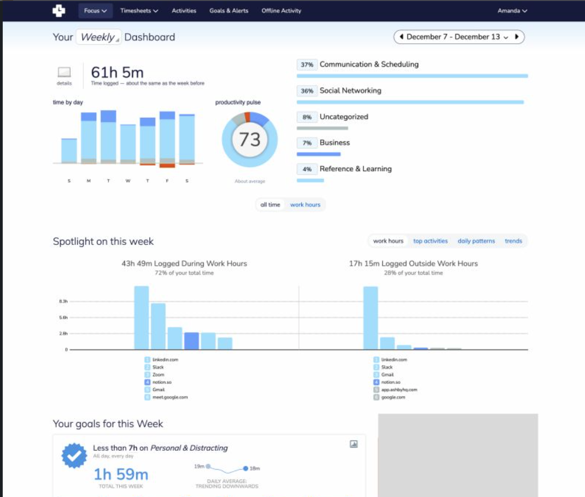

<p align="center">
  
</p>

# Tempo

Tempo is a native macOS menu bar app for polling-based personal time tracking.

Instead of asking you to start and stop timers, Tempo checks in on a schedule, asks what you are working on, and records time against a project. It is intentionally local-first and single-user: no accounts, no sync, no web service, and no passive surveillance.

<table>
  <tr>
    <td width="50%">
      
    </td>
    <td width="50%">
      
    </td>
  </tr>
</table>

## Why This Exists

Manual timers are easy to forget and hard to trust after a long day. Auto-tracking apps are hard to configure across projects. Tempo takes a different approach:

- It prompts you at a configurable interval.
- It lets you classify the time that just passed.
- It keeps the data on your Mac.
- It gives you daily, weekly, monthly, and yearly analytics without needing a backend.
- In auto-tracking apps, a lot of time is spend configuring what "type" of work are you doing, in case you share same apps across multiple projects.

The goal is simple: make time tracking accurate enough that you do not have to reconstruct your day from memory.

## What Tempo Does

- Runs as a native macOS menu bar app with a full app window for project management and analytics.
- Prompts for check-ins on a configurable cadence instead of using manual start/stop timers.
- Stores a flat local project list for quick assignment during check-ins.
- Detects idle/away periods and keeps them from contaminating active work totals.
- Supports a "Done for day" mode that silences prompts until the next configured day cutoff.
- Shows analytics by day, week, month, and year.
- Exports allocated intervals to CSV for use in spreadsheets or other tooling.
- Supports launch at login using the native macOS login item mechanism.

## How It Works

Tempo records check-ins, not live-running timers. From those check-ins it derives time intervals and attributes them to either:

- A project
- Idle time

That model keeps the workflow lightweight while still producing useful reports. When the app detects idle time or an unanswered prompt, it preserves that state so the next check-in can classify time correctly.

## Getting Started

### Requirements

- macOS 15 or later
- Xcode 16 or later

### Run in Xcode

1. Open `Package.swift` in Xcode.
2. Select the `TempoApp` executable target.
3. Build and run the app.

Tempo launches as a menu bar app and also provides a main window for project management and analytics.

### Build From Terminal

```bash
swift build
```

### Run Tests

```bash
swift test
```

## Using Tempo

1. Add a few projects in the main window.
2. Let Tempo prompt you on its polling interval.
3. Pick the project you were working on, or mark the time as idle/done for day.
4. Review the resulting breakdown in Analytics.
5. Export CSV if you want the underlying intervals outside the app.

Key settings currently available:

- Polling interval
- Idle threshold
- Analytics day cutoff hour
- Launch at login
